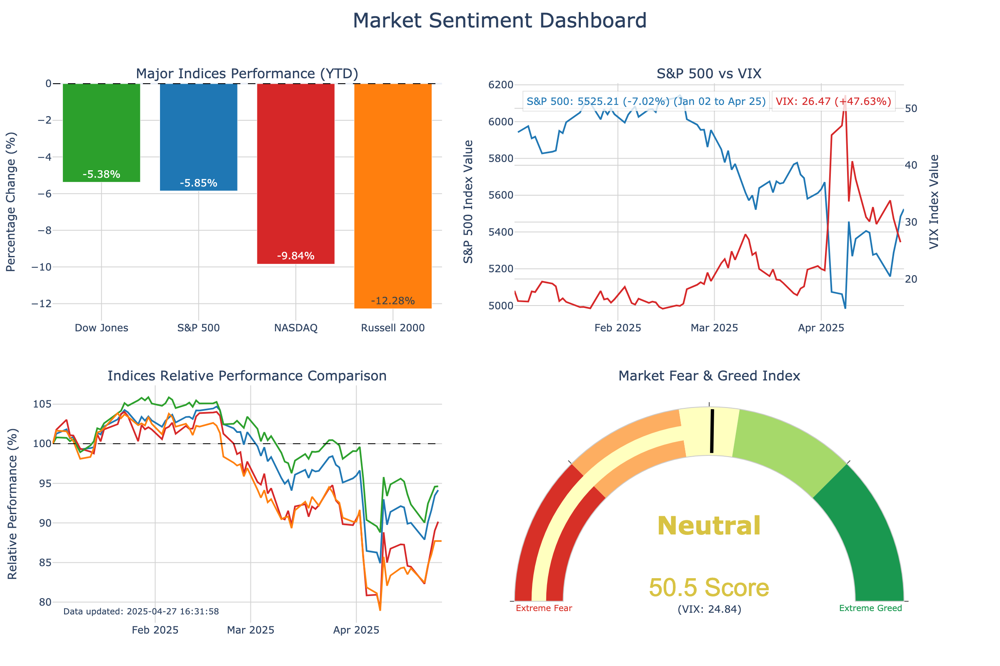
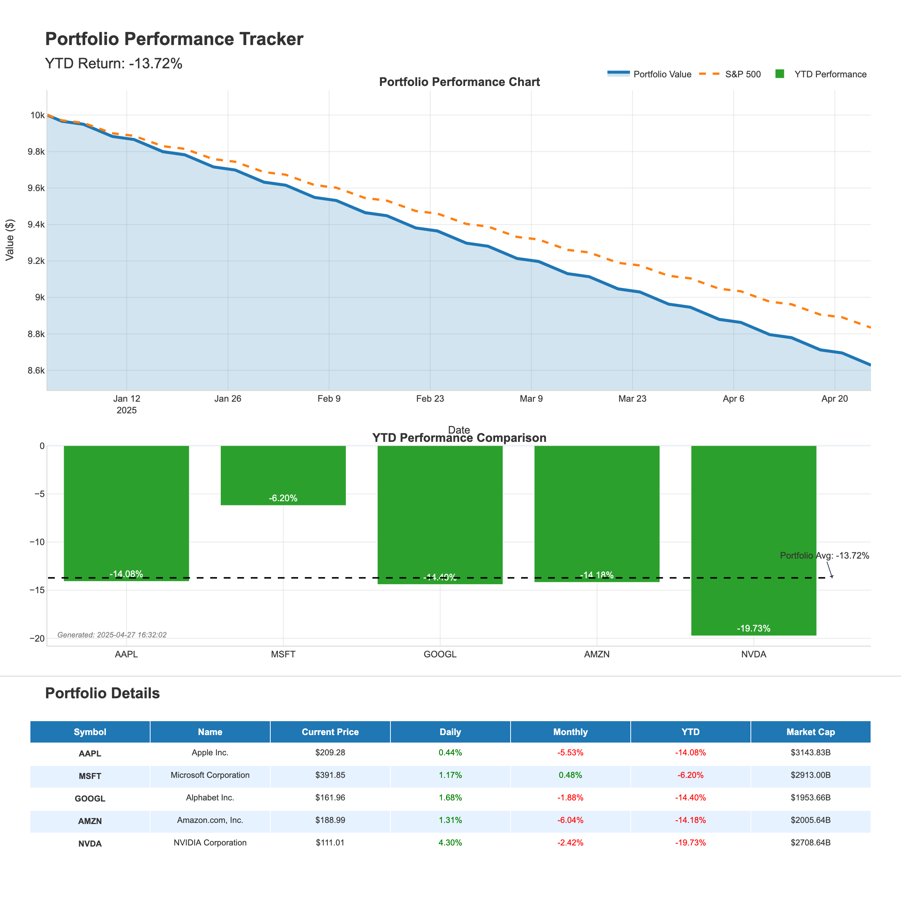
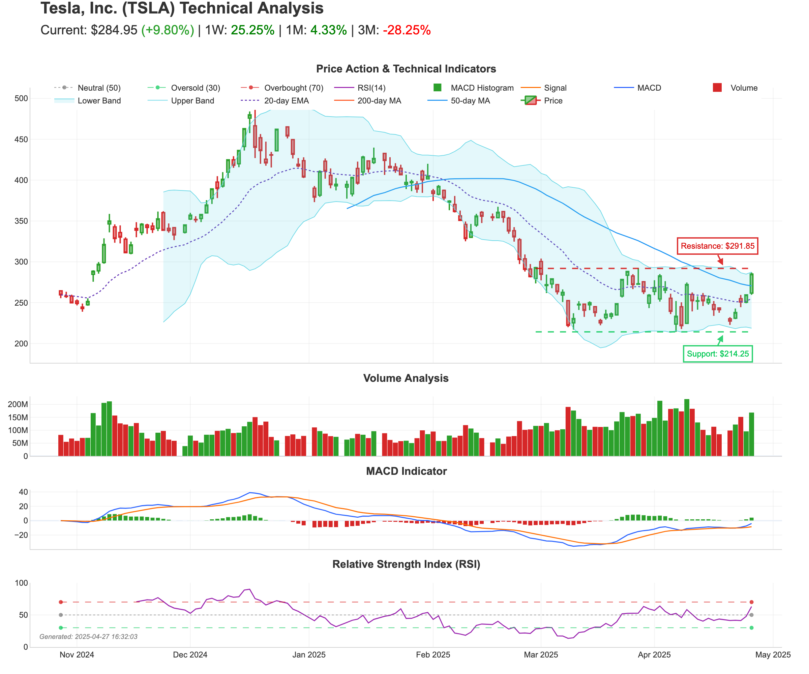

# MCP Yahoo Finance

一个用于 Yahoo Finance 交互的 [Model Context Protocol](https://modelcontextprotocol.io) (MCP) 服务器。该服务器提供了获取价格、公司信息和生成金融可视化的工具。

> 本项目是 [maxscheijen/mcp-yahoo-finance](https://github.com/maxscheijen/mcp-yahoo-finance) 的分支和扩展，增加了可视化功能。

## 功能特点

- **金融数据**：获取当前股票价格、历史价格、股息、收益报表等
- **可视化分析**：生成美观的市场情绪、投资组合跟踪和技术分析可视化图表
- **轻松集成**：与 Claude Desktop、VS Code、Cursor 和其他 MCP 客户端兼容

## 安装

如果你使用 [`uv`](https://docs.astral.sh/uv/)，你无需手动安装 `mcp-yahoo-finance`。我们将使用 [`uvx`](https://docs.astral.sh/uv/guides/tools/) 直接运行 `mcp-yahoo-finance`。

```sh
pip install mcp-yahoo-finance
```

### 使用 Git

你也可以在克隆仓库到你的机器后安装此包。

```sh
git clone https://github.com/leoncuhk/mcp-yahoo-finance.git
cd mcp-yahoo-finance
uv sync
```

## 配置

### Claude Desktop

将以下内容添加到你的 `claude_desktop_config.json`：

```json
{
    "mcpServers": {
        "yahoo-finance": {
            "command": "uvx",
            "args": ["mcp-yahoo-finance"]
        }
    }
}
```


### VSCode

将以下内容添加到你的 `.vscode/mcp.json`：

```json
{
    "servers": {
        "yahoo-finance": {
            "command": "uvx",
            "args": ["mcp-yahoo-finance"]
        }
    }
}
```

### Cursor

将以下内容添加到你的 Cursor MCP 配置：

```json
{
    "mcp-servers": {
        "yahoo-finance": {
            "command": "uvx",
            "args": ["mcp-yahoo-finance"]
        }
    }
}
```

## 可用工具

### 基础金融数据
- **get_current_stock_price**：获取股票的当前价格
- **get_stock_price_by_date**：获取特定日期的股票价格
- **get_stock_price_date_range**：获取一段时间内的股票价格
- **get_historical_stock_prices**：获取可自定义周期的历史股票数据
- **get_dividends**：获取股票的股息信息
- **get_income_statement**：获取收益报表数据
- **get_cashflow**：获取现金流量表数据
- **get_earning_dates**：获取盈利日期信息
- **get_news**：获取股票的最新新闻

### 可视化工具
- **generate_market_dashboard**：创建包含实时指数表现的市场情绪仪表板
- **generate_portfolio_report**：生成投资组合表现跟踪报告
- **generate_stock_technical_analysis**：为股票创建技术分析报告

## 可视化示例

### 市场情绪仪表板


### 投资组合跟踪


### 股票技术分析


## 示例提示

以下是一些可以在 Claude 中尝试的示例提示：

### 基础金融数据
1. "苹果股票的当前价格是多少？"
2. "苹果和谷歌的股票价格有什么区别？"
3. "苹果股票在 2023-01-01 到 2023-12-31 之间的价格变化了多少？"

### 可视化请求
1. "生成一个显示主要指数表现的市场情绪仪表板。"
2. "为科技股 AAPL、MSFT、GOOGL、AMZN 和 NVDA 创建一个投资组合跟踪报告。"
3. "向我展示一个特斯拉股票的技术分析图表，包括移动平均线和支撑/阻力位。"
4. "用标普500指数、道琼斯指数和纳斯达克指数生成一个市场情绪仪表板。"
5. "你能为我的能源股 XOM、CVX、BP、COP 和 SLB 创建一个投资组合报告吗？"
6. "我需要一个 NVDA 股票的详细技术分析，显示 RSI 和交易量模式。"

## 运行测试

要测试可视化功能：

```sh
cd tests
python test_visualization.py
```

这将在 `examples` 目录中生成示例可视化图像。


## 使用 MCP Inspector 测试

```sh
npx @modelcontextprotocol/inspector uv run mcp-yahoo-finance
```


## 使用示例提示语

现在用户可以通过Claude使用以下提示语来生成可视化：

```
1. **市场情绪分析仪表板**:
   ```
   请生成一个市场情绪分析仪表板，展示S&P 500、道琼斯和纳斯达克的实时表现和恐惧/贪婪指标。
   ```

2. **投资组合表现跟踪**:
   ```
   请创建一个技术股投资组合的表现跟踪报告，包括AAPL、MSFT、GOOGL、AMZN和NVDA。
   ```

3. **股票技术分析**:
   ```
   请对特斯拉(TSLA)股票进行技术分析，展示价格趋势、移动平均线、支撑位和阻力位。
   ```

4. **自定义指数的市场情绪分析**:
   ```
   请生成一个市场情绪分析仪表板，展示指数^FTSE,^N225,^HSI的实时表现。
   ```

5. **自定义股票的投资组合跟踪**:
   ```
   请创建一个能源股投资组合的表现跟踪报告，包括XOM,CVX,BP,COP,SLB。
   ```

6. **自定义股票的技术分析**:
   ```
   请对英伟达(NVDA)股票进行技术分析，展示价格趋势、RSI和交易量模式。
   ```

```


## 许可证

本项目采用 MIT 许可证 - 详情请参阅 LICENSE 文件。

## 致谢

- 原始项目由 [Max Scheijen](https://github.com/maxscheijen) 创建
- 可视化功能的扩展灵感来自 [tooyipjee](https://github.com/tooyipjee) 